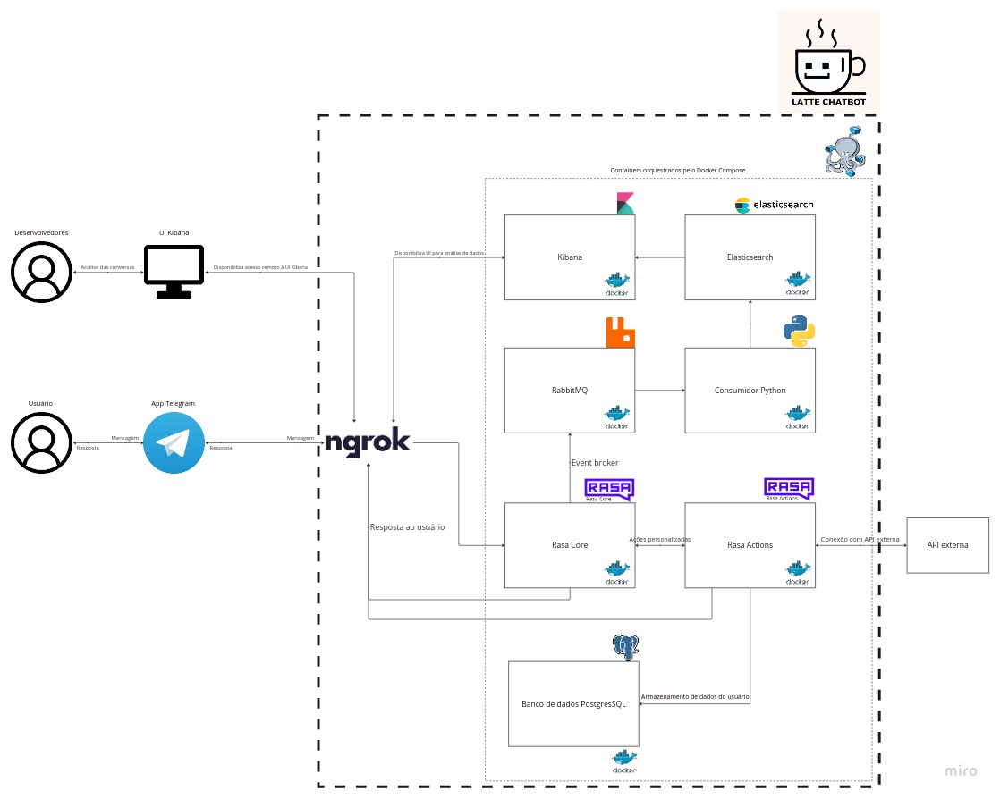

# Latte Chatbot
## Sobre
Esse repositório contém a implementação do [Latte Chatbot](https://web.telegram.org/k/#@latte_chatbot).

O Latte é chatbot gamificado par auxílio na produção de artigos científicos. Seguindo a metodologia [GCMP](), o Latte foi desenvolvido como um Trabalho de Conclusão de Curso da Universidade de Brasília, por: 

| Desenvolvedor| Desenvolvedor| Co-orientador | Orientador |
|--------------|--------------|---------------|------------|
|  |  |  |  |
| [Victor Eduardo](https://github.com/victorear05) | [Luiz Henrique](https://github.com/luiz-hfz) | [Arthur Temporim](https://github.com/arthurTemporim) | [Sérgio Freitas](https://github.com/sergioaafreitas) |

## Arquitetura
O projeto baseia-se em 7 contêineres Docker orquestrado pelo Docker compose, são eles:
- **Rasa Core:** Framework que fornece a interface inicial para o chatbot.
- **Rasa Actions:** Extensão do Rasa Core para criação e uso de funções em Pyhton personalizadas.
- **PostgresSQL:** Banco de dados para armazenar dados do usuários.
- **RabbitMQ:** _Event broker_ que recebe os eventos  (conversas) do rasa e os transmite.
- **Consumidor Genérico:** Implementação em python que recebe os eventos do RabbitMQ e os trasmite para o Elasticsearch.
- **Elasticsearch:** Armazena as conversas e disponibiliza ao Kibana.  
- **Kibana:** Com base nos dados armazenados pelo elasticsearch, fornece uma interface UI para análise das conversas.


## Como executar (Ubuntu)
### Pré-requisitos
#### Instalar Ngrok
- https://ngrok.com/download
#### Instalar Docker
- https://docs.docker.com/engine/install/ubuntu/
#### Instalar Docker Compose
- https://docs.docker.com/compose/install/linux/#install-the-plugin-manually
#### Criar um bot no Telegram
- https://core.telegram.org/bots/tutorial
### Passo a passo
1. Clone o repositório
```git clone git@github.com:latte-chatbot/chatbot.git```
2. Entre no diretório chatbot
```cd chatbot```
3. Crie uma cópia do arquivo .env-example com o nome .env
```cp .env-example ./.env```
4. Preencha com suas credenciais no arquivo `.env`  
- Deixe a credencial `ES_USERNAME` como `elastic`.  
5. Fazer o build do container bot
```sudo docker compose build --no-cache bot```
6. Treinar o bot
```sudo docker compose run --rm bot rasa train```
7. Executar o bot
```sudo docker compose up -d bot```
- Após alguns instantes o bot estará disponível via Telegram.

### Comandos úteis
#### Testes (rasa test)
```sudo docker compose run --rm bot rasa test```
#### Testes (model-report)
```sudo docker compose run --rm bot rasa-model-report --output-path results/```
#### Shell
```sudo docker compose run --rm bot rasa shell```